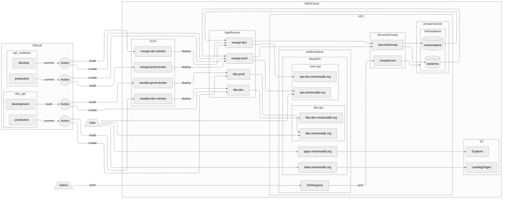

# Cloud Infrastructure

Neotoma runs as a set of components using cloud infrastructure. Neotoma's transition to the cloud occurred as a result of an NSF Grant through the CloudBank program, providing direct project funding for cloud compute resources. Through this grant we were able to deploy Neotoma as a secure cloud-available database, with multiple services, including the API, landing pages, backup and file storage and web domain management.

## System Architecture Overview

## Core Architecture Components

### Github Repositories

The [Neotoma Database GitHub organization](https://github.com/NeotomaDB) is a core component of the database's architecture. All tools and infrastructure for Neotoma are managed through GitHub with the exception of the database's data definition file and data content.

Individual code repositories are linked to external services through [Github Actions](https://docs.github.com/en/actions/get-started/understand-github-actions), which control the way in which repositories are built and then deployed, as well as AWS CloudFormation infrastructure files that define the AWS services that are linked together to serve the applications.

Neotoma Actions are all contained in a `.github/workflows/deploy.yaml` file within individual repositories. These files define individual steps that are taken when a branch of the repository is pushed (or when periodic actions take place). The files may make use of environment variables or GitHub Secrets, such as passwords, user names, network addresses and other critical information.

### AWS Infrastructure

AWS Infrastructure consists of several key elements:

* **S3 Storage**: For database snapshots, large file storage, and delivery of "static" websites
* **Electronic Container Registry (ECR)**: For Docker containers of key software products (APIs, Python services)
* **Relational Database Service (RDS)**: For the main Neotoma Database, its backup services and ongoing maintenance
* **CloudWatch**: To manage log files for services and to observe web service status
* **Virtual Private Cloud (VPC)**: The virtual space where all cloud services are provided
* **Route 53**: The service to route Neotoma Cloud services to various web URLS
* **CloudFront**: The service to cache and serve data for Neotoma websites to reduce load time
* **Batch**: A service for code execution in the cloud, generally for longer-running services
