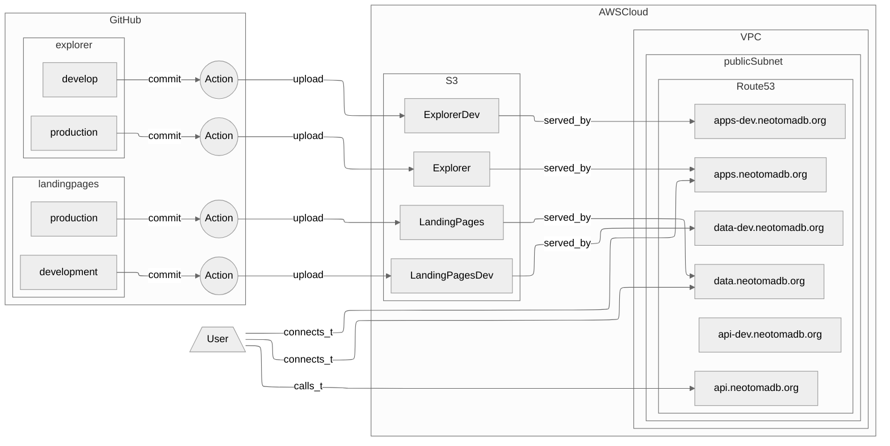

# S3 Storage

## S3 Resources

S3 is the storage we use for serving static resources (Landing Pages, Explorer) and to serve snapshots of Neotoma data.

### System Overview

The S3 services are connected to our Route53 service which connects applications and internal AWS URLs to namespaces (`neotomadb.org`). Static resources (they are compiled and then largely served through the client's own browser) include Neotoma Explorer (built with Dojo) and the Neotoma Landing pages (built with Vue.js). Remote storage of database snapshots is managed through FarGate and the Batch service.

## Resources

