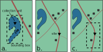
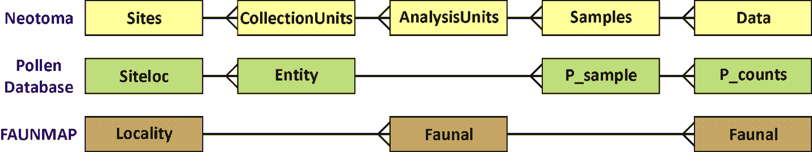
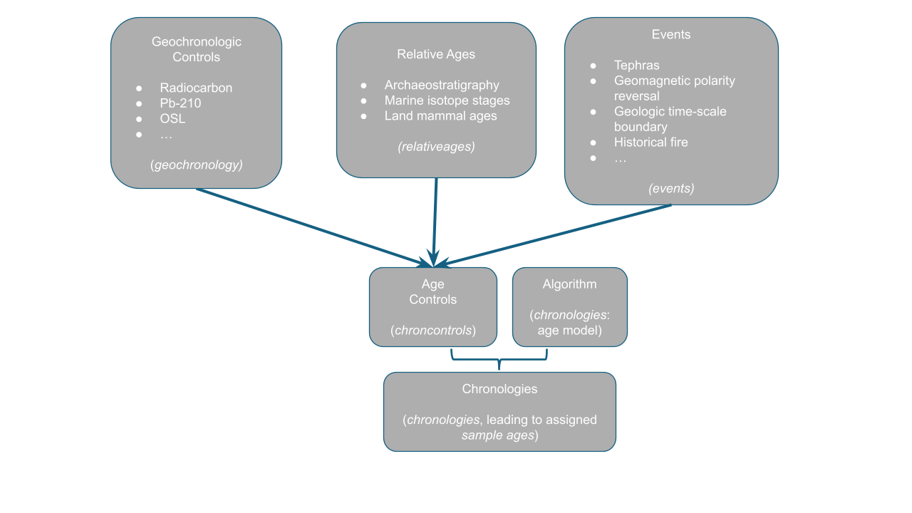
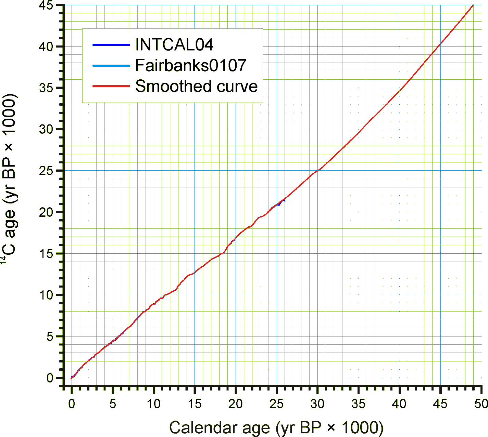
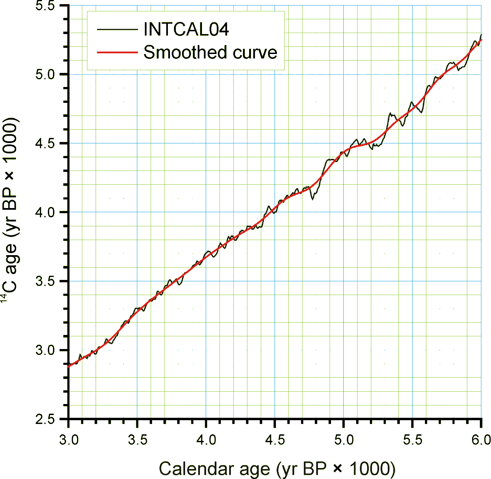
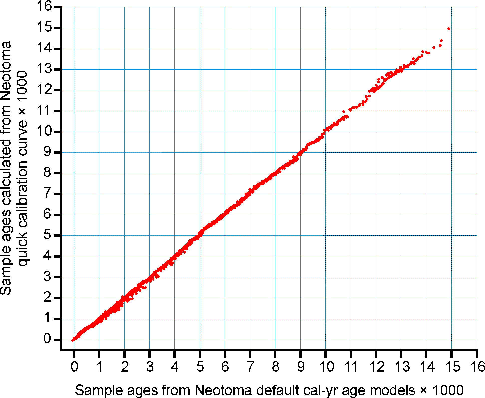
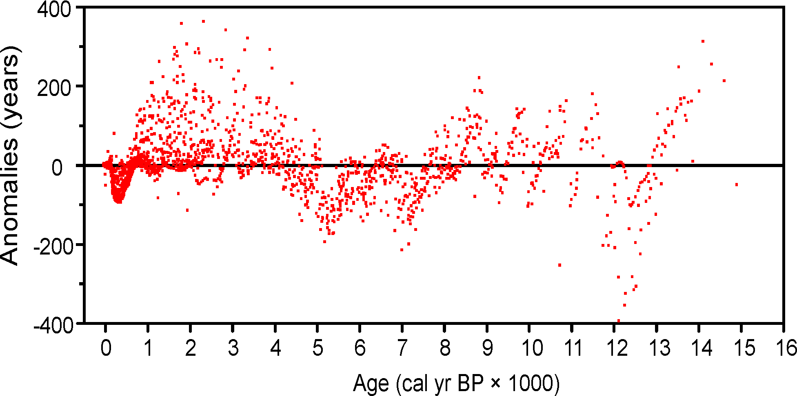
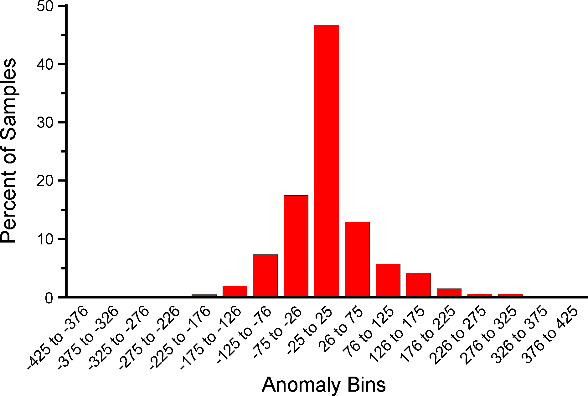

# Database Design Concepts

The Neotoma database itself is a highly normalized object that contains over 150 distinct tables, allowing us to uniquely and precisely describe individual occurrences of paleoecological elements in space and time, and ascribe to those observations information about the mode of preparation, collection and publication. An [interactive database schema](https://open.neotomadb.org/dbschema) is available through the Neotoma website. See **Figure 1**.


_**Figure 1**. The Entity-Relationship Diagram for the Neotoma Database. This image is a scalable vector graphic and can be opened in a new window by right-clicking the image and selecting "Open image in new tab". Tables are represented by boxes, and the lines connecting individual tables represent primary key -> foreign key relationships._

## Sites, Collection Units, Analysis Units, Samples, and Datasets

Fossil data are **site** based. A [`site`](./tables/sites.md) has a name, latitude-longitude coordinates (with a projection), altitude, and areal extent. In Neotoma, *sites* are designated geographically as points or polygons, and subsequently converted into bounding boxes with north and south latitude coordinates and east and west longitude coordinates. Neotoma uses a Postgres database, and represents spatial data using [postgis's geography object](http://postgis.net/workshops/postgis-intro/geography.html). Most legacy sites in Neotoma are represented only using point coordinates. See **Figure 2**.



_**Figure 2**. Three panels showing context for Neotoma's geographic representation of sites. In panel **a** a site is defined by the boundaries of a lake. The site also has a bounding box, and the core location is defined by a collection unit within the site that is defined with precise coordinates. In panel **b** a site is defined as a single point, for example, from a textual reference indicating the site is at the intersection of two roads. Here the site and collection unit share the unique point location. In panel **c** we show how that site location may be obfuscated using a bounding box as the site delimiter. In this case the collection unit would not be defined (but is represented as the triangle for illustration)._

The lat-long box can circumscribe the site, for example a lake (*Figure 2a*), or it may circumscribe a larger area in which the site lies either because the exact location of the site is not known or because the exact location is purposely kept vague (*Figure 2c*). In the case of many legacy sites, the exact location is not know precisely; for example, it may have been described as *on a gravel bar 5 miles east of town*. The exact locations of some sites have purposely been kept vague to prevent looting and vandalism.

A [`Collection Unit`](./tables/collectionunits.md) is a unit from a site from which a collection of fossils or other data have been made. Typical Collection Units are cores, sections, and excavation units. A site may have several Collection Units. A Collection Unit is located spatially within a site and may have precise GPS latitude-longitude coordinates. Its definition is quite flexible. For pollen data, a Collection Unit is typically a core, a section, or surface sample. A Collection Unit can also be a composite core comprised of two or more adjacent cores pieced together to form a continuous stratigraphic sequence. A Collection Unit can also be an excavation unit. For faunal data, a Collection Unit could be as precise as an excavation square, or it could be a group of squares from a particular feature within a site. For example, consider a pit cave with three sediment cones, each with several excavation squares. Collection Units could be defined as the individual squares, or as three composite Collection Units, one from each sediment cone. Another example is an archaeological site, from which the reported Collection Units are different structures, although each structure may have had several excavation squares. The precision in the database depends on how data were entered or reported.

For many published sites, the data are reported from composite Collection Units. If faunal data are reported from a site or locality without explicit Collection Units, then data are assigned to a single Collection Unit with the name *Locality*.

Different kinds of data may have been collected from a single Collection Unit, for example fauna and macrobotanicals from an excavation, or pollen and plant macrofossils from a lake-sediment core. A composite Collection Unit may include data from different milieus, which, nevertheless, are associated with each other, for example a diatom sample from surficial lake sediments and an associated lake-water sample for water-chemistry measurements.

The Collection Unit is equivalent to the *Entity* in the Global Pollen Database but was not defined in FAUNMAP. When the FAUNMAP data were imported into Neotoma, most localities were assigned a single *Locality* Collection Unit. However, for some localities, the data were assigned to different Collection Units that were clearly identifiable in FAUNMAP (see **Figure 3**).



_**Figure 3**. A diagram showing the relationships between tables in Neotoma, the Pollen Database, and FAUNMAP. Because the Global Pollen Database had only pollen, no need existed for the concept of Analysis Units, which may have multiple data types. FAUNMAP did not make a hierarchical distinction between Collection Units and Analysis Units, and the data for both Analysis Units and fauna are contained in the Faunal table, although within the Faunal table, implicit one-to-many relationships exist between Localities and Analysis Units and between Analysis Units and faunal data._

An [`Analysis Unit`](./tables/analysisunits.md) is a stratigraphic unit within a Collection Unit and is typically defined in the vertical dimension. An Analysis Unit may be a natural stratigraphic unit with perhaps irregular depth and thickness or it may be an arbitrary unit defined by absolute depth and thickness. An excavation may have been dug in arbitrary units, for example 10 cm levels, or it may have followed natural stratigraphic boundaries, for example the *red zone* or a feature in an archaeological site. Although Analysis Units could be designated by an upper depth and lower depth, in Neotoma they are designated by their midpoint depth and thickness, which is more convenient for developing age models. Pollen and other microfossils are typically sampled at arbitrary depths, and although these samples have thicknesses corresponding to the thickness of the sampling device (usually 1 cm or less), these thicknesses are often not reported, just the depths. Different kinds of samples may have been taken from a single analysis unit, for example pollen, diatoms, and ostracodes. The Analysis Unit links these various samples together.

In larger excavations, natural stratigraphic Analysis Units may cut across excavation squares or Collection Units, and the data are reported by Analysis Unit rather than by Collection Unit. In this case, the fossil data are assigned to a generic composite Collection Unit named *Locality*, which has the explicitly defined Analysis Units. If the Analysis Units are not described or reported, then the data are assigned to a single Analysis Unit with the name *Assemblage*. Thus, for a locality published with only faunal list, the fauna are assigned to a Collection Unit named *Locality* and to an Analysis Unit named *Assemblage*.

In FAUNMAP, Analysis Units are the primary sample units, and fauna are recorded by Analysis Unit. In the GPD, Analysis Units correspond to samples.

[`samples`](./tables/samples.md) are of a single data type from an Analysis Unit. For example, there may be a vertebrate faunal sample and a macrobotanical sample from the same Analysis Unit; or there may be a pollen sample and an ostracode sample from the same Analysis Unit. There can be multiple samples of the same data type from an Analysis Unit, for example two pollen samples counted by different analysts. Normally, vertebrate fossils from an Analysis Unit comprise a single sample; however, if the fossils are of mixed age, individually dated bones may be treated as separate samples, each with a precise age. In addition to fossils, samples may also be used for physical measurements, such as loss-on-ignition. Geochronologic measurements, such as radiocarbon dates, are made on geochronologic samples.

A [`dataset`](./tables/datasets.md) is a set of Samples of a single data type from a Collection Unit. For example the pollen data from a core comprise a pollen Dataset. The geochronologic samples from a Collection Unit form a geochronologic Dataset. Every Sample is assigned to a Dataset, and every Dataset is assigned to a Collection Unit. Samples from different Collection Units cannot be assigned to the same Dataset (although they may be assigned to Aggregate Datasets).

## Taxa and Variables

In general, a single `sample` in Neotoma has an associated set of taxa, from the same dataset type, with some measure of abundance. The [`data`](./tables/data.md) table in Neotoma has fields for `sampleid`, `variableid`, and `value`. **Variables** -- listed in the [`variables`](./tables/variables.md) table -- consist of a **`taxon`**, referenced by the [`taxa`](./tables/taxa.md) table, as well as the identified **`element`**, measurement **`units`**, **`context`**, and **`modification`**. Because of the way Neotoma data is structured, non-biological elements are also contained within the `taxa` table; for example, there is an entry for *loss-on-ignition*. For this reason, the field `taxagroupid` identifies the "taxon" type, and the hierarchy (the column `highertaxonid`) helps the user understand the context of the taxon name.

**Table 1.** The `taxa` table entry for *loss-on-ignition*, showing the `taxagroupid`. The `highertaxonid` value of 5783 points to the `loss-on-ignition` entry itself, it does not belong to a hierarchy.

 taxonid | taxoncode |    taxonname     | author | valid | highertaxonid | extinct | taxagroupid | publicationid | validatorid | validatedate | notes
---------+-----------+------------------+--------+-------+---------------+---------+-------------+---------------+-------------+--------------+-------+---------------------+---------------------
    5783 | LOI       | loss-on-ignition |        | t     |          5783 | f       | LOI         |               |          44 | 2013-02-18   |

* For biological taxa, the **`element`** is the organ or skeletal element. Typical faunal elements are bones, teeth, scales, and other hard body parts. Bone and tooth elements may be specifically identified (e.g. *tibia* or even more precisely *tibia, distal, left*, *M2, lower, left*). Some soft elements also occur in the database (e.g. *hair* and *dung*). For mammals, an unspecified element is *bone/tooth*. Elements for plant macrofossils are the organs identified (e.g. *seed*, *needle*, *cone bract*). Pollen and spores are treated simply as taxon elements. Thus, *Picea* seeds, *Picea* needles, and *Picea* pollen are three different `variables`. All three refer to a single entry in the [`taxa`](./tables/taxa.md) table for *Picea*.
* Variable **Units** are the measurement units. For faunal data, the most common are *present/absent*, *number of individual specimens* (NISP), and *minimum  number of individuals* (MNI). Plant macrofossils have many different quantitative and semi-quantitative measurement Units, including concentrations and relative abundance scales. Measurement Units for pollen are NISP (counts) and *percent*. For pollen the preferred measurement Unit is NISP, but for some sites only percentage data are available. *Picea* pollen NISP and *Picea* pollen percent are two different Variables.
* Variable **Contexts** for fauna include *articulated*, *intrusive*, and *redeposited*. A context for pollen is *anachronic*, which refers to a pollen type known to be too old for the contemporary sedimentary deposit. Most Variables do not have a specified context.
* Variable **Modifications** include various modifications to fossils or modifiers to Variables, including human modifications to bones (e.g. *bone tool*, *human butchering*, *burned*) and preservational and taphonomic modifications (e.g. *carnivore gnawed*, *fragment*). Modifications for pollen include preservational classifications such as *corroded* and *degraded*.

## Taxonomy and Synonymy

Neotoma does not change or question identifications from original sources, although taxonomic names may be synonymized to currently accepted names. Thus, for example, the old (although still valid) non-standard plant family names such as Gramineae and Compositae are synonimized to their standard family names terminated with *-aceae*, viz. Poaceae and Asteraceae. Neotoma has not attempted to establish complete or comprehensive synonymies. However, the [`synonyms`](./tables/synonyms.md) table lists commonly encountered synonyms. The descriptions of the [`synonymtypes`](./tables/synonymtypes.md) and [`taxa`](./tables/taxa.md) tables contain fuller discussions of synonymiztions made in Neotoma.

An important feature of Neotoma is that the [`taxa`](./tables/taxa.md) table is hierarchical. Each Taxon has a HigherTaxonID, which is the TaxonID of the next higher taxonomic rank. Thus, data are stored at the highest taxonomic resolution reported by the original investigators, but can be extracted
at a higher taxonomic level.

Synonymy presents a challenge for any organismal database, particularly for one such as Neotoma, which archives data collected for over a century and which archives extinct taxa, often for which few and fragmentary specimens exist. Many changes are due to increased understanding of the diversity within taxonomic groups and of the phylogenetic relationships within and among groups. Other changes are due purely to taxonomic rules or conventions set by the International Code of Botanical Nomenclature (McNeill et al. 2006) and the International Code of Zoological Nomenclature (International Commission on Zoological Nomenclature 1999). Working groups representing the different taxonomic groups included in Neotoma have established appropriate taxonomic authorities:

* Plants -- There is no worldwide authority. The International Plant Names Index[^1] lists validly published names, but a listed name is not necessarily the accepted name for a given taxon. For families, Neotoma follows the Angiosperm Phylogeny Group II (2003) and Stevens (2007+), which follows and updates APG II. The APG is an international consortium of plant taxonomists, and the APG classification utilizes the great quantity of phylogenetic data generated in recent years. For lower taxonomic ranks, the various pollen database cooperatives follow appropriate regional floras:
* North American Pollen Database/North American Plant Macrofossil Database: Insofar as possible, follows the *Flora of North America* (Flora of North America Editorial Committee 1993+); about half of the planned FNA volumes have been published. Otherwise, appropriate regional floras are followed.
* European Pollen Database: The EPD has a Taxonomy Support Group. In general, nomenclature follows *Flora Europaea* (Tutin 1964-1993).
* African Pollen Database: The APD has a Committee for Nomenclature, which has produced a list of pollen types with misspellings, synonymy, and nomenclature corrected[^2]. APD nomenclature follows *Enumération des plantes à fleurs d\'Afrique Tropicale* (Lebrun and Stork 1991-1997).
* Latin American Pollen Database: has a tremendously rich and diverse flora and no comprensive flora is available. Various regional floras are followed.
* Indo-Pacific Pollen Database: For Australia and adjacent areas follows the *Australian Plant Name Index* (Chapman 1991). For other regions, appropriate regional floras are followed.
* Pollen Database for Siberia and the Russian Far East Follows *Vascular Plants of Russia and Adjacent States* (Czerepanov 1995).
* Mammals -- For extant taxa, the authority is Wilson and Reeder's (2005) *Mammal Species of the World* . Original sources are followed for extinct species, and the database is considered authoritative.
* Birds -- For North America, the authority is the American Ornithologists' Union *Check-list of North American Birds* (American Ornithologists\' Union 1983).
* Fish -- Follows the *Catalog of Fishes* (Eschmeyer 1998).
* Mollusks -- For North America, follows *Common and Scientific Names of Aquatic Invertebrates from the United States and Canada: Mollusks* (Turgeon et al. 1998).
* Beetles -- Comprehensive manuals do not exist. Original taxonomic authorities are cited, and the database is considered authoritative.

## Taxa and Ecological Groups

In the [`taxa`](./tables/taxa.md) table, each taxon is assigned a TaxaGroupID, which refers to the [`taxagrouptypes`](./tables/taxagrouptypes.md) table. These are major taxonomic groups, such as *Vascular plants*, *Diatoms*, *Testate amoebae*, *Mammals*, *Reptiles and amphibians*, *Fish*, and *Molluscs*. Also included are *Charcoal* and *Physical variables*. 

**Ecological Groups** are groupings of taxa within Taxa Groups, which may be ecological or taxonomic. Ecological Groups are assigned in the [`ecolgroups`](#EcolGroups) table, in which taxa are assigned an `ecolgroupid`, which links to the [`ecolgrouptypes`](#EcolGroupTypes) table, and an EcolSetID, which links to the [`ecolsettypes`](#EcolSetTypes) table.

Ecological Groups are commonly used to organize taxa lists and stratigraphic diagrams. For any taxonomic group, more than one Ecological Set may be assigned. For example, beetles may be assigned to a set of ecological groups, such as dung and bark beetles, and to second set based on taxonomy. Vascular plants are assigned to a *Default plant* set comprised of groups such as *Trees and Shrubs*, *Upland Herbs*, and *Terrestrial Vascular Cryptogams*. Default pollen diagrams can then be generated based on a pollen sum of these three groups. Mammals are assigned to a *Vertebrate orders* set.

## Chronology

Neotoma stores both the archival data used to reconstruct chronologies as well as interpreted chronologies derived from the archival data. The basic data used to reconstruct chronologies occurs in three tables:

* [`geochronology`](#Geochronology),
* [`tephrachronology`](#Tephrachronology), and
* [`relativechronology`](#RelativeChronology).

The [`geochronology`](#Geochronology) table includes geophysical measurements such as radiocarbon, thermoluminescence, uranium series, and potassium-argon dates. This table also includes dendrochronological dates derived from tree-ring chronologies, for example logs in archaeological structures. The [`tephrachronology`](#Tephrachronology) table records tephras in Analysis Units. This table refers to the [`tephras`](#Tephras) lookup table, which stores the ages for known tephras. The [`relativechronology`](#RelativeChronology) table stores relative age information for Analysis Units. Relative age scales include the archaeological time scale, geologic time scale, geomagnetic polarity time scale, marine isotope stages, North American land mammal ages, and Quaternary event classification. For example, diagnostic artifacts from an archaeological site may have cultural associations with a known age ranges, which can be assigned to Analysis Units. The faunal assemblage from an Analysis Unit may be assignable to particular land mammal age, which places it within a broad time range. Sedimentary units may be assigned to particular geomagnetic chrons, marine isotope stages, or Quaternary events, such as a particular interglacial. Many of these relative ages have rather broad time spans, but do provide some chronologic control. See **Figure 4** for a visual overview of these relationships.



_**Figure 4**. A schematic of the way that Neotoma handles chronological metadata. Geochrological measurements, tephras, and other relative chronologies are archived in the database, and the particular measurements used to create any given chronology from which sample ages are assigned are indexed as well._

Actual Chronologies are constructed from the basic chronologic data in the [`geochronology`](#Geochronology), [`tephrachronology`](#Tephrachronology), and [`relativechronology`](#RelativeChronology) tables. These chronologies are stored in the [`chronologies`](#Chronologies) table. A Chronology applies to a Collection Unit and consists of a number of Chron Controls, which are ages assigned to Analysis Units. A Chron Control may be an actual geochronologic measurement, such as a radiocarbon date, or it may be derived from the actual measurement, such as a radiocarbon date adjusted for an old carbon reservoir or calibrated to calendar years. A Chron Control may by an average of several radiocarbon dates from the same Analyis Unit. Different kinds of basic chronologic data may be used to assign an age to an Analysis Unit, for example radiocarbon dates and diagnostic archaeological artifacts. Some relative Chron Controls are not from one of the established relative time scales. Examples of these are local biostratigraphic controls, which may be based on dated horizons from nearby sites. A familiar example in is the *Ambrosia*-rise, which marks European settlement. The exact date varies regionally, depending on when settlement occurred locally. For a given site, the date assigned to the *Ambrosia*-rise may be based on historical information about when settlement occurred or possibly on geophysical dating (e.g. <sup>210</sup>Pb) of a nearby site.



_**Figure 5**. Smoothed quick radiocarbon calibration curve. At the scale of this figure the difference is mostly less than the line thickness._

For continuous stratigraphic sequences, such as cores, not every Analysis Unit may have a direct date. Therefore, ages are commonly interpolated between dated Analysis Units. In this case, the ChronControls are the age-depth control points for an age model, which may be linear interpolation between Chron Controls or a fitted curve or spline.

Age is measured in different time scales, the two most commn being radiocarbon years before present (<sup>14</sup>C yr BP) or presumed calendar years before present (cal yr BP). For a calibrated radiocarbon date, *cal yr BP* technically stands for *calibrated years before present*, i.e. calibrated to calendar years. In Neotoma, *cal yr BP* is used for both calibrated radiocarbon years and for other ages scales presumed to be in calendar years, viz. dendrochronologic years and other geochronlogic ages believed to be in calendar years. The zero datum for any *BP* age is AD 1950, regardless of its derivation. Thus, BP ages younger than AD 1950 are negative---AD 2000 = ‑50 BP.



Ages may be reported in AD/BC age units, in which case bc years are stored as negative values. If ages are reported with a datum other than AD 1950 for BP years, the ages must be converted to an AD 1950 datum or to the AD/BC age scale before entry into Neotoma. For example, <sup>210</sup>Pb dates are often reported relative to the year of analysis; these must be converted to either AD/BC or *cal yr BP* with an AD 1950 datum.

_**Figure 6**. An enlarged portion of Figure 2 showing the monontonic smoothed curve_

Radiocarbon years can be calibrated to calendar years with a calibration curve. The current calibration curve for ≤26,000 cal yr BP (=21,341<sup>14</sup>C yr BP) is the INTCAL04 calibration curve (Reimer et al. 2004). Various programs, both online and standalone, are available for calibrating individual radiocarbon dates, two of the more popular are CALIB[^3] (Stuiver and Reimer 1993) and OxCal[^4] (Bronk Ramsey 1995, 2001), both available online for download. Calibration of radiocarbon years beyond the INTCAL04 curve is more controversial. However, the Fairbanks0107 curve is available for calibration of radiocarbon dates to 50,000 cal yr BP, the practial limit of radiocarabon dating (Fairbanks et al. 2005, Chiu et al. 2007), with an online application[^5].


_**Figure 7**. Sample ages calculated from the Neotoma quick calibraton curve vs. ages calculated from traditional age models._

Calibrated radiocarbon dates better represent the true time scale and the true errors and probability distributions of the age estimates. In addition, other important paleo records, notably the ice cores and tree-ring records, have calendar-year time-scales. Therefore, for comparison among proxies and records, it is clearly desirable to place all records on the same time-scale, viz. a calendar-year time-scale. Although this goal is laudable, most of the data ingested into Neotoma from other databases is on a radiocarbon time scale. The majority of assigned ages and almost all the ages from the pollen database are interpolated ages derived from age models. The proper method for deriving calibrated ages is to calibrate the radiocarbon dates and then reinterpolate new ages between these calibrated dates.

Virtually all age models are problematic. A key problem is that most age models linearly interpolate between age-depth points or fit functions or splines to points. However, radiocarbon ages are not points, but probability distributions. Moreover, the probability distributions of calibrated ages are non-Gaussian. Each calibrated age has a unique probability distribution, and many are bimodal or multimodal. Various investigators have used different points, including the intercepts of the radiocarbon age with the calibration curve and the midpoint of the 1σ or 2σ probability distributon. The former is particularly inappropriate (Telford et al. 2004b). The 50% median probability is probably the best single point; however, because of multimodality, this particular point may, in fact, be very unlikely. Nevertheless, if it falls between more-or-less equally probable modes, it may still be the best single point. Most age models for cores are based on relataively few radiocarbon dates, and the uncertainties of the interpolated ages are unknown and large (Telford et al. 2004a). Indeed, chronology is perhaps the greatest challenge for future research with this database.



_**Figure 8**. Anomalies (Sample ages from Neotoma default calendar-year age models minus ages calculated with the Neotoma quick calibration curve) vs. time._

Given the need for a common age scale and the enormity of the task to properly develop new age models, a [`radiocarboncalibration`](#RadiocarbonCalibration) conversion table was developed to quickly convert sample ages in radiocarbon years to calendar years. These calibrated ages are for perusal and data exploration; however, the differences between these ages and those calculated with traditional age models are relatively small. The table contains radiocarbon ages from -100 to 45,000 in 1-year increments with corresponding calibrated values. The table was generated by smoothing the INTCAL04 calibration curve with an FFT filter so that the curve is monotonically increasing, i.e. so that there are no age reversals in calibrated age. The INTCAL04 curve is in 5-yr increments from -5 to 12,500 <sup>14</sup>C yr BP, 10-yr increments from 12,500 to 15,000 <sup>14</sup>C yr BP, and 20-yr increments from 15,000 to 26,000 <sup>14</sup>C yr BP. The FFT filter was 50 points (250 yr) for the first interval, 25 points (250 yr) for the second interval, and 10 points (200 yr) for the third interval. For the calibration beyond 26,000 <sup>14</sup>C yr BP, a calibrated age was determined with the Fairbanks0107 calibration curve every 100 years with a standard deviation of ±100 years from 20,000±100 <sup>14</sup>C yr BP to 46,700±100 <sup>14</sup>C yr BP. These were then smoothed with a 5-sample (500-yr) FFT filter. The curve kinks sharply after 45,000 <sup>14</sup>C yr BP, so the quick calibration curve was terminated at this date. The Fairbanks0107 curve diverges somewhat from the INTCAL04 curve for the portion they overlap in age. From 20,000 to 26,000 <sup>14</sup>C yr BP, the difference was prorated linearly from zero divergence from the INTCAL04 curve at 20,000 <sup>14</sup>C yr BP to zero divergence from the Fairbanks0107 curve at 26,000 <sup>14</sup>C yr BP. **Figure 4** shows the smoothed curve, and Error! Reference source not found. shows an enlargement of part of the curve.

An analysis was made to assess the deviation between ages derived from traditionally calibrated age models and ages derived from the quick calibration curve. From the database, 57 default Chronologies in calibrated radiocarbon years were selected. The Chron Controls were all calibrated radiocarbon dates, except for top dates, European settlement dates, and <sup>210</sup>Pb dates in the uppermost portions of the cores. A few Chronologies used the Zdanowicz et al. (1999) calendar-year age from the GISP2 ice core. Ages beyond the reliable age limit (`chronologies.ageboundolder`[#Chronologies]) were not used. These 57 Chronologies had a total of 1945 Sample Ages in calibrated radiocarbon years. **Figure 4** shows graph of ages from the Neotoma age models vs. the ages calculated with the quick calibration curve. Error! Reference source not found. shows the anomalies vs. time and **Figure 6** shows a histogram of the distribution of anomalies. Nearly half (47%) of the anomalies are \<25 years, 86% are \<100 years, 97% are \<200 years, and 99.4% are \<300 years. The average absolute anomaly is 49.2 years, and the median is 29 years. Thus, the quick calibration curve provides remarkably good results. The ages have no confidence limits, but neither do the interpolated ages of most age models.



_**Figure 9**. Binned distribution of anomalies between Neotoma default calendar-year age models and ages calculated with the Neotoma quick calibration curve._

## Sediment and Depositional Environments

Several tables deal with depositional environments, depositional agents, and sediment descriptions. In Neotoma, the **Depositional Environment**
refers to the Depositional Environment of the site today, for example, *Fen*, *Cave*, *Colluvial Fan*. Depositional Environments may vary within a Site. For example, a lake with a marginal fen has lake and fen Depositional Environments. Thus, Depositional Environments are an attribute of Collection Units and are assigned in the [`collectionunits`](#CollectionUnits) table. Depositional Environments are listed in the in the [`depenvttypes`](#DepEnvtTypes) lookup table, and they are hierarchical, for example:

> Glacial Lacustrine

Any of these Depositional Environments may be assigned to a Collection Unit, but because they are hierarchical, Collection Units may be grouped at higher levels, for example, all Collection Units from natural lakes. The top level Depositional Environments, with some examples, are:

```{sql, topleveldepenv, connection=db}
SELECT depenvt AS "Depositional Environment" 
FROM ndb.depenvttypes 
WHERE depenvtid = depenvthigherid 
LIMIT 10;
```

The Depositional Environment may change through time. For example, as a basin fills with sediment, it may convert from a lake to a fen and perhaps later to a bog. A colluvial slope may have alluvial sediments at depth. A modern playa lake may have a buried paleosol. Thus, a sediment section may have units with different facies and depositional agents. The **Facies** is the sum total of the characteristics that distinguish a sedimentary unit. Facies are listed in the
[`faciestypes`](./tables/faciestypes.md) lookup table and are assigned to Analysis Units in the `AnalysisUnits.FaciesID <AnalysisUnits>`{.interpreted-text role="ref"} field. A sedimentary unit may have one or more agents of deposition. For example, a cave deposit may be partly owing to human habitation and partly to carnivore activity. Depositional Agents are listed in the [`depagenttypes`](./tables/depagenttypes.md) lookup
table and are assigned to Analysis Units in the [`depagents`](./tables/depagents.md) table.

Whereas Facies and Depositional Agents are both keyed to Analysis Units, the [`lithology`](#Lithology) table is keyed to Collection Units. Analysis Units, especially from cores, may not be contiguous but be placed at discrete intervals down section. Lithologic units are defined by depth in the Collection Unit. Whereas Facies have short descriptions and are keyed to the [`faciestypes`](#FaciesTypes) lookup table, the `Lithology.Description`[#Lithology] field is a memo, and lithologic descriptions much more detailed than Facies descriptions. FAUNMAP, which was built around Analysis Units, stores Facies and Depositional Agent data; whereas the pollen database, which was centered on Collection Units, stores lithologic data.

## Date Fields

Neotoma uses date fields in several tables. Dates are stored internally as a double precision floating point number, which facilitates calculations and functions involving dates. The disadvantage is that complete dates must be stored, i.e. year, month, and day; whereas in many cases only the year or month are known, for example the month a core was collected. Neotoma had adapted the convention that if only the month is known, the day is set to the first of the month; if only the year is known, the month and day are set to January 1. Thus, *June 1984* is set to *June 1, 1984*; and *1984* is set to *January 1, 1984*. The drawback, of course, is that these imprecise dates cannot be distinguished from precise dates on the first of the month. However, it was determined that the advantages of the date fields outweighed this disadvantage.

[^1]: <http://www.ipni.org>

[^2]: <http://medias.obs-mip.fr/apd/>

[^3]: <http://calib.qub.ac.uk/calib/>

[^4]: <http://c14.arch.ox.ac.uk/embed.php?File=oxcal.html>

[^5]: <http://radiocarbon.ldeo.columbia.edu/research/radcarbcal.htm>
