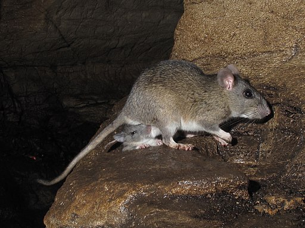

# Database Documentation

Welcome to the research database documentation. This section provides comprehensive information about the database schema, tables, and usage patterns.

## About the Database

The Neotoma Paleoecology Database is a public, community curated database containing fossil data from the Holocene, Pleistocene, and Pliocene, or approximately the last 5.3 million years [@Williams2018a]. Neotoma stores biological data, and associated physical data from fossil bearing deposits or the depositional environments from which datasets have been obtained. For example, sediment loss-on-ignition and geochemical data from lake sediments, or modern water chemistry data from water bodies from which diatoms have been collected. The database also stores data from modern samples that are used to interpret fossil data.

The initial development of Neotoma was funded by a grant from the U.S. National Science Foundation Geoinformatics program. The inital grant was a collaborative proposal between Penn State University [@nsf0622349] and the Illinois State Museum [@nsf0622289]. It had five Principle Investigators, Russell W. Graham, Eric C. Grimm, Stephen T. Jackson, Allan C. Ashworth, and John W. (Jack) Williams.

Initially, data within Neotoma were merged from four existing databases: the Global Pollen Database, FAUNMAP, a database of mammalian fauna [@Group1994], the North American Plant Macrofossil Database, and a fossil beetle database [@Morgan1983-pu] assembled by Allan Ashworth. Although structurally different, these databases contain similar kinds of data, and merging them was quite practical. The rationale for this merging was twofold:

1. To facilitate analyses of past biotic communities at the ecosystem level
2. To reduce the overhead in maintaining and distributing several independent databases

Because the proxy types that Neotoma integrated were sufficiently diverse, the data model had to focus on the commonalities as the core of the database structure, specifically elements of *stratigraphy* and *chronology*. This design facilitated the gradual inclusion of other database types including the addition of ostracode, diatom, chironmid, and freshwater mussel datasets.

The Neotoma database was initially designed by Eric C. Grimm and implemented in Microsoft® Access®. Neotoma was ported to SQL Server, where it was served from the [Center for Environmental Informatics](https://sites.psu.edu/environmentalinformatics/) at Penn State University. Subsequently the database was ported to PostgreSQL, to support a fully open data ecosystem with an Application-Program Interface (API) that could be integrated into R packages [e.g., @goring2015neotoma] or other programming languages.

Neotoma is now hosted through Amazon Web Services with support from the [National Sciences Foundation](https://www.nsf.gov/awardsearch/showAward?AWD_ID=1948227) and [CloudBank](https://www.cloudbank.org/). Much of the Neotoma infrastructure is open, and clearly defined through a set of open code repositories on GitHub at [https://github.com/NeotomaDB](https://github.com/NeotomaDB).

## Whence Neotoma

|  |
|:--:|
| A packrat of the genus *Neotoma*. Credit: Alan Cressler, CC BY-SA 2.0 <https://creativecommons.org/licenses/by-sa/2.0>, via Wikimedia Commons |

Neotoma was called a "Late Neogene Terrestrial Ecosystem Database" in the [original NSF proposal](https://nsf.gov/awardsearch/showAward?AWD_ID=0622289). In 2006, when the proposal was written, the Neogene Period included the Miocene, Pliocene, Pleistocene, and Holocene epochs. In 2010 an International Commission on Stratigraphy proposal elevated the Quaternary to a System or Period that followed the Neogene [@gibbard2010formal], and terminating the Neogene at the end of Pliocene. To account for the change in nomenclature, numerous names and companion acronyms were considered, but none engendered enthusiastic support. B. Brandon Curry proposed the name **Neotoma**, and this name struck a fancy. *Neotoma* is the [genus for the packrat](https://en.wikipedia.org/wiki/Pack_rat). Packrats are prodigious collectors of anything in their territory, and moreover they are collectors of fossil data. **Neotoma** packrats collect plant macrofossils and bones, and pollen is preserved in their amberat -- hardened, dried urine, which impregnates their middens and preserves them for millennia.

Since its origin, Neotoma has expanded the number of dataset types that are managed, and the time bounds that Neotoma represents. In 2024 the [Neotoma Executive Council](https://www.neotomadb.org/people) agreed to remove the temporal limits on datasets within Neotoma, supporting the addition of a new data group arising from the Ocean Drilling Project.

## Rationale

Paleobiological data from the recent geological past have been invaluable for understanding ecological dynamics at timescales inaccessible to direct observation, including ecosystem evolution, contemporary patterns of biodiversity, principles of ecosystem organization, particularly the individualistic response of species to environmental gradients, and the biotic response to climatic change, both gradual and abrupt. Understanding the dynamics of ecological systems requires ecological time series, but many ecological processes operate too slowly to be amenable to experimentation or direct observation. In addition to having ecological significance, fossil data have tremendous importance for climatology and global change research. Fossil floral and faunal data are crucial for climate-model verification and are essential for elucidating climate-vegetation interactions that may partly control climate.

Basic paleobiological research is site based, and paleobiologists have devoted innumerable hours to identifying, counting, and cataloging fossils from cores, sections, and excavations. These data are typically published in papers describing single sites or small numbers of sites. Often, the data are published graphically, as in a pollen diagram, and the actual data reside on the investigator's computer or in a file cabinet. These basic data are similar to museum collections, costly to replace, sometimes irreplaceable, and their value does not diminish with time. Also similar to museum collections, the data require cataloging and curation. Whereas physical specimens of large fossils, such as animal bones, are typically accessioned into museums, microfossils, such as pollen, are not accessioned, and the digital data are the primary objects, and their loss is equivalent to losing valuable museum specimens. The integrated database that we propose ensures safe, long-term archiving of these data.

Large independent databases exist for fossil pollen, plant macrofossils, and mammals: the Global Pollen Database (GPD), the North American Plant Macrofossil Database (NAPMD), and FAUNMAP. In addition, a database of fossil beetles (BEETLE) has been assembled and integrated into Neotoma. These databases, as with others in the Earth and ecosystem sciences, have become essential cyberinfrastructure. Nevertheless, these resources were originally developed as standalone databases in the early 1990's. GPD and NAPMD were stored in [Paradox®](https://en.wikipedia.org/wiki/Paradox_(database)) file formats; FAUNMAP in [Microsoft Access](https://en.wikipedia.org/wiki/Microsoft_Access). Since initial database development, emphasis has been placed on ingest of new and legacy data. However, database and Internet technology have advanced greatly since 1995, and the current relational database software, ingest programs, data retrieval algorithms, output formats, and analysis tools are outdated and minimal. Moreover, the databases are not linked, so that integrated analyses are difficult.

Although GPD, NAPMD, and FAUNMAP were developed independently, they have much in common. The basic data of all three databases as well as BEETLE are essentially lists of taxa from cores, excavations, or sections, often with quantitative measures of abundance. The three databases include similar metadata. The objective of Neotoma is to build a unified data structure that will incorporate all of these databases. The database will initially incorporate pollen, plant macrofossil, mammal, and beetle data. However, the database designed facilitates the incorporation of all kinds of fossil data.

Various teams of investigators have developed databases for paleobiological data that have been project or discipline based, including the four databases to be integrated in this project. However, long-term maintenance and sustainability have been problematic because of the need to secure continuous funding. Nevertheless, these databases have become the established archives for their disciplines and, new data are continuously contributed. However, because of funding hiatuses, long spells may intervene between times of data contribution and their public availability. For example, a number of databases contributed data, but then remained unchanged since the initial contribution. The number of different databases and disciplines exacerbates the problem, because each database requires a lead steward. Consolidation of informatics technology helps address this overhead issue. However, specialists are still essential for management and supervision of data collection and quality control for their disciplines or organismal groups.

The purposes of Neotoma are:

* to facilitate studies of ecosystem development and response to climate change
* to provide the historical context for understanding biodiversity dynamics, including genetic diversity
* to provide the data for climate-model validation
* to provide a safe, long-term, low-cost archive for a wide variety of paleobiological data.

Site-based studies are invaluable in their own right, and they are the generators of new data. However, much is gained by marshalling data from geographic arrays of sites for synoptic, broad-scale ecosystem studies. In order to carry out such studies efficiently, a queryable database is required. Thus, it is much more than an archive; it is essential cyberinfrastructure for paleoenvironmental research. The database facilitates integration, synthesis, and understanding, and it promotes information sharing and collaboration. The individual databases have been extensively used for scientific research, with several hundred scientific publications directly based upon data drawn from these databases. This project will enhance those databases and will continue their public access. By integrating these databases and by simplifying the contributor interface, we can reduce the number of people necessary for community-wide database maintenance, and thereby help ensure their long-term sustainability and existence.

## Who Will Use Neotoma?

The existing databases have been used widely for a variety of studies. Because the databases have been available on-line, precise determination of how many publications have made use of them is difficult. In addition, the databases are widely used for instructional purposes. Below are examples of the kinds of people who have used these databases and who we expect will find the new, integrated database even more useful.

* **Paleoecologists** seeking to place a new record into a regional/continental/global context (e.g., Bell and Mead 1998, Czaplewski et al. 1999, Bell and Barnosky 2000, Newby et al. 2000, Futyma and Miller 2001, Gavin et al. 2001, Czaplewski et al. 2002, Schauffler and Jacobson 2002, Camill et al. 2003, Rosenberg et al. 2003, Willard et al. 2003, Pasenko and Schubert 2004, and many others).
* **Synoptic paleoecologists** interested in mapping regional to sub-continental to global patterns of vegetation change (e.g., Jackson et al. 1997, Williams et al. 1998, Jackson et al. 2000, Prentice et al. 2000, Thompson and Anderson 2000, Williams et al. 2000, Williams et al. 2001, Williams 2003, Webb et al. 2004, Williams et al. 2004, Asselin and Payette 2005).
* **Synoptic paleoclimatologists** building benchmark paleoclimatic reconstructions for GCM evaluation (e.g., Bartlein et al. 1998, Farrera et al. 1999, Guiot et al. 1999, Kohfeld and Harrison 2000, CAPE Project Members 2001, Kageyama et al. 2001, Kaplan et al. 2003).
* **Paleontologists** trying to understand the timing, patterns, and causes of extinction events (e.g., Jackson and Weng 1999, Graham 2001, Barnosky et al. 2004, Martínez-Meyer et al. 2004, Wroe et al. 2004).
* **Evolutionary biologists** mapping the genetic legacies of Quaternary climatic variations (e.g., Petit et al. 1997, Fedorov 1999, Tremblay and Schoen 1999, Hewitt 2000, Comps et al. 2001, Good and Sullivan 2001, Petit et al. 2002, Kropf et al. 2003, Lessa et al. 2003, Petit et al. 2003, Hewitt 2004, Lascoux et al. 2004, Petit et al. 2004, Whorley et al. 2004, Runck and Cook 2005).
* **Macroecologists** interested in temporal records of species turnover and biodiversity and historical controls on modern patterns of floristic diversity (e.g., Silvertown 1985, Qian and Ricklefs 2000, Brown et al. 2001, Haskell 2001).
* **Archeologists** who are studying human subsistence patterns and interactions with their environment (e.g., Grayson 2001, Grayson and Meltzer 2002, Cannon and Meltzer 2004, Grayson in press).
* **Natural resource managers** who need to know historical ranges and abundances of plants and animals for designing conservation and management plans (e.g., Graham and Graham 1994, Cole et al. 1998, Noss et al. 2000, Owen et al. 2000, Committee on Ungulate Management in Yellowstone National Park 2002, Burns et al. 2003)
* **Scientists** trying to understand the potential response of plants, animals, biomes, ecosystems, and biodiversity to global warming (e.g., Bartlein et al. 1997, Davis et al. 2000, Barnosky et al. 2003, Burns et al. 2003, Kaplan et al. 2003, Schmitz et al. 2003, Jackson and Williams 2004, Martínez-Meyer et al. 2004)
* **Teachers** who use the databases for teaching purposes and class exercises [@goring].

## Navigation

- **[Table Overview](overview.md)** - Summary of all database tables
- **[Tables](tables/)** - Detailed documentation for each table
- **[Common Queries](queries.md)** - Frequently used query patterns
- **[Schema Diagram](schema.md)** - Visual representation of table relationships

## Connection Information

See the [connection guide](connection.md) for details on accessing the database.

---

*Documentation last updated: {{ last_validated() }}*